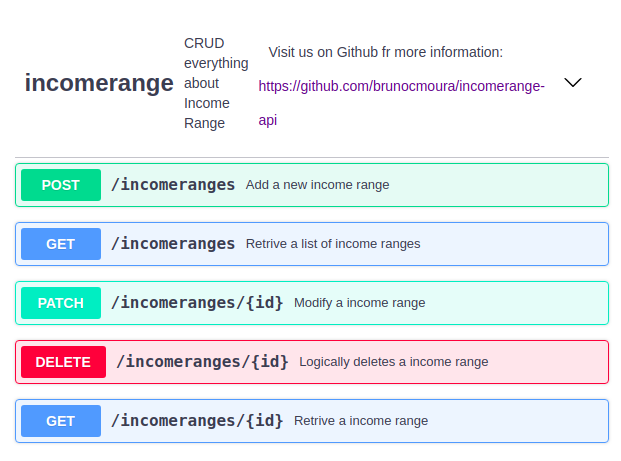

 # Income Range API
A NodeJS Application for maintain a domain of income ranges information.



## About this project

The idea of this API is:

In context of microservice environment, we have here an application for managing informations about income range.


## Why

This project was created for my personal portifolio, so if you could let me any feedback I'd appreciate so much. Any comment that can make me a better programmer will be help a lot!

And for sure, you can use this Project as you wish!

It's free!

## Contact info

My [LinkedIn](https://www.linkedin.com/in/bruno8moura/)

My email bruno8moura@gmail.com

## Getting started

### Prerequisites

NodeJS version: ^12.14.0
Docker version: ^19.03.8


### Installing

```
$ git clone https://github.com/brunocmoura/incomerange-api.git
$ cd incomerange-api

```

### Running application

```
$ echo 'Don't forget to grant the necessaries permissions to the script, ./bin/startup/hello-world, to run'

$ npm run hello-world
```

## Build with

- [express](https://www.npmjs.com/package/express) - Creates an abstraction layer on NodeJS features, in order to facilitate the creation of web solutions.
  
- [body-parser](https://www.npmjs.com/package/body-parser) - The payload request will be parsed based on "Content-Type" header. Once payload parsed, the content will be available on "req.body".
  
- [cls-hooked](https://www.npmjs.com/package/cls-hooked) - Holds a workspace that is accessible from every point from a stack calls. Used by [cls-rtracer](https://www.npmjs.com/package/cls-rtracer) module.
  
- [cls-rtracer](https://www.npmjs.com/package/cls-rtracer) - Is useful because besides generate an id for each request and hold it in the CLS, it uses the header "X-Request-Id", when it exists, from request instead generating a new id.

- [json-patch](https://www.npmjs.com/package/json-patch) - A library that facilitate the use of JSON Patches([RFC-6902](http://tools.ietf.org/html/rfc6902)) in JavaScript. Used for operations HTTP Patch.
  
- [log4js](https://www.npmjs.com/package/log4js) - Log solution.

- [mongoose](https://www.npmjs.com/package/mongoose) - Is a MongoDB object modeling tool(e.g. Modeling documents, validating documents before insert/update, etc). 

- [mongoose-auto-increment](https://www.npmjs.com/package/mongoose-auto-increment) - Auto-increments any ID field on your schema every time a document is created.
